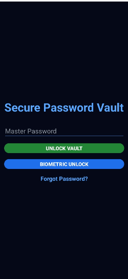
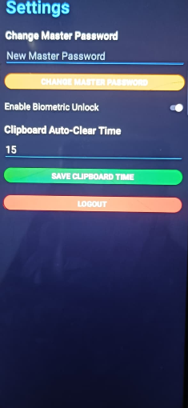
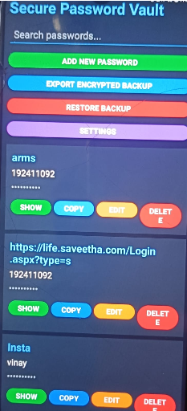

# 🔐 Secure Password Vault

Advanced Offline Password Manager built using Kotlin and Android Studio.

🌐 Live Website:
https://amazing-fox-26bf79.netlify.app/

---

# 📱 About The Project

Secure Password Vault is a futuristic Android application designed for securely storing passwords using encrypted offline storage.

The application provides:

* Blowfish encrypted password storage
* SHA-256 master password protection
* Biometric authentication
* Recovery key system
* Backup & restore support
* Clipboard auto-clear security
* Password strength checker
* Strong password generator
* Modern dark cyber-style UI
* Offline privacy protection

All data remains stored locally on the device without cloud dependency.

---

# 🚀 Features

## 🔒 Security Features

* Blowfish Encryption
* SHA-256 Protection
* Offline Local Storage
* Recovery Key System
* Screenshot Protection
* Clipboard Auto Clear
* Secure Vault Locking

---

## 📲 Authentication

* Master Password Login
* Biometric Fingerprint Unlock
* Forgot Password Recovery
* Secure Session Handling

---

## 🛠 Vault Features

* Add Passwords
* Edit Passwords
* Delete Passwords
* Copy Passwords
* Search Passwords
* Password Visibility Toggle

---

## ⚡ Advanced Features

* Password Strength Checker
* Strong Password Generator
* Automatic App Lock
* Encrypted CSV Backup Export
* Backup Restore System
* Cyberpunk Dark UI

---

# 🖼 App Screenshots

## Login Screen



---

## Security Settings



---

## Vault Dashboard



---

# ⚙ Technologies Used

* Kotlin
* Android Studio
* Room Database
* XML UI Design
* Android Biometric API
* SharedPreferences
* Blowfish Encryption
* SHA-256 Hashing
* RecyclerView

---

# 🔐 Cryptography Concepts Used

This project implements concepts from:

* Classical Cryptography
* Symmetric Key Cryptosystems
* Hash Algorithms
* Authentication Mechanisms

### Algorithms Used

* Blowfish Encryption Algorithm
* SHA-256 Hashing

---

# 📥 Download APK

APK available on website:

https://amazing-fox-26bf79.netlify.app/

---

# 📦 Installation

1. Download APK
2. Open APK file
3. Enable "Install Unknown Apps"
4. Install application
5. Create Master Password
6. Start using Secure Password Vault

---

# 💾 Backup System

The application supports encrypted local backup export.

Exported backups are stored as encrypted CSV files containing:

* Website
* Username
* Encrypted Password

Backup Location:

```txt
Downloads/SecureVaultBackup
```

---

# 🧠 Future Improvements

* Cloud Sync
* AI Password Strength Analysis
* Multi-device Sync
* Theme Customization
* Breach Detection API
* Auto Password Rotation

---

# 👨‍💻 Developer

Developed by:

## Vinay Kosuri

Cybersecurity-focused Android application project.

---

# 📄 License

This project is developed for educational and portfolio purposes.
